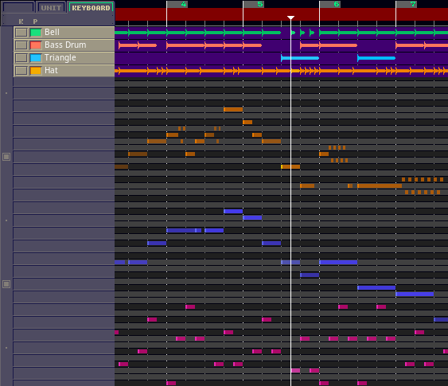

# ptweb
<div align="center">  </div>
<div align="center"> Pxtone web player with visuals. Work in progress.</div>

## Demo
Check out [pxtone web](https://www.ptweb.me/) for a full-fledged platform for sharing pxtone pieces using this player! A slightly outdated demo for playing local files is available [here](https://yuxshao.github.io/ptweb/).

## Install
Make sure Emscripten is installed. I have 1.38.36 myself. Install all `js` dependencies in the submodules:
```
cd pxtnDecoder
npm install
```
```
cd PxtoneJS
npm install
```
Then `make` in the parent folder. Run `python3 server.py` and navigate to `http://localhost:8080/`.

## Thanks
Thanks to Pixel for making this wonderful software, and [petamoriken](https://github.com/petamoriken) for the [decoder](https://github.com/petamoriken/PxtnDecoder) and [base audio player/JS library](https://github.com/petamoriken/PxtoneJS)!
